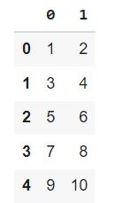
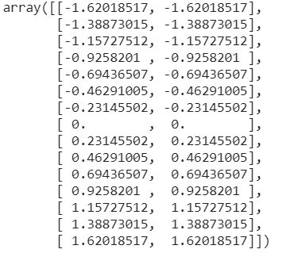

# Scaling

## StandardScaler
Standardize features by removing the mean and scaling to unit variance.    
The standard score of a sample x is calculated as: $ z = \frac{(x-u)}{s} $

```python
import pandas as pd   
from sklearn.preprocessing import StandardScaler   
scaler=StandardScaler()       
data = [i for i in range(1,31)]          
data.reshape(-1,2)                 
x=pd.DataFrame(data)     
```       
   
```python
scaler.fit_transform(data)  
```  


### Attributes
scaler.mean_ and scaler.var_
### save and load the scaler 
```python
import joblib
scaler_filename = "scaler.save"
joblib.dump(scaler, scaler_filename) 
#Load scaler
scaler = joblib.load(scaler_filename) 
```

## MinMaxScaler

`from sklearn.preprocessing import MinMaxScaler`   
`data = [[-1, 2], [-0.5, 6], [0, 10], [1, 18]]`   
`scaler = MinMaxScaler()`   
`print(scaler.fit(data))`     
`MinMaxScaler()`   
`print(scaler.data_max_)`   
[ 1. 18.]   
`print(scaler.transform(data))`   
[[0.   0.  ]
 [0.25 0.25]
 [0.5  0.5 ]
 [1.   1.  ]]   
`print(scaler.transform([[2, 2]]))`   
[[1.5 0. ]]

## MaxAbsScaler 
`from sklearn.preprocessing import MaxAbsScaler`
`X = [[ 1., -1.,  2.],`   
`[ 2.,  0.,  0.],`   
`[ 0.,  1., -1.]]`   
`transformer = MaxAbsScaler().fit(X)`   
`transformer`   
`MaxAbsScaler()`   
`transformer.transform(X)y
array([[ 0.5, -1. ,  1. ],
       [ 1. ,  0. ,  0. ],
       [ 0. ,  1. , -0.5]])

## RobustScaler


