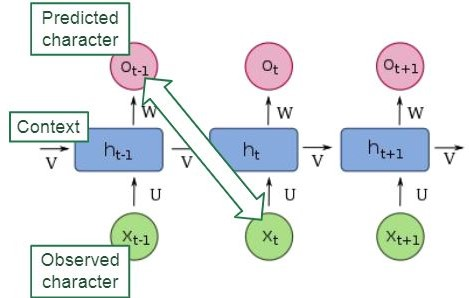
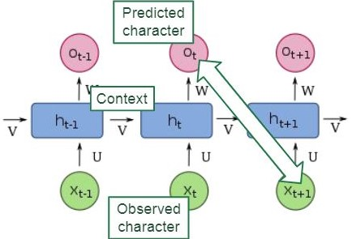
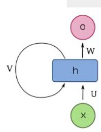

# Introduction

Natural Language processing applications do not follow the ssumption of independently and identically distributed (i.i.d.).  For example, the words in sentence are arranged in a meaningful way. If we disturb the order the meaning changes, Why? each word is dependent on the previous word. So we need a different architecture that captures temporal structure in sentence. The same is case with the time series data, where each data point is also a function of its previous satapoint. we shall look at various instances architecture like RNN(Recuurent neural network), LSTM(Long Short Term Memory) and GRU (Gated recurrent Unit)  that captures temporal context for a time series problem.

## RNN 

Like Convolutional Neural Networks share parameters across space, RNNs share parameters over time. The following example predicting next character based on previous character is demonstrated in below images.    
     
So for every input $x_t$ we are calculating context $h_t$ and output computed based on $h_t$ and $h_t-1$, where $h_t-1$ is computed from previous observatopn $x_t-1$.  So variable h holds the context of the sequence. An RNN function is implemented as     
${h_t=f(x_t,h_t-1)}$  
$h_t= \phi(Ux + Vh_t-1 + b_h)$    
$\hat{y}= g(Wh_t + b_y)$ 
Where U,V and W are the weight matrices to compute conetxt variable $h$ and output $y$ .  

### Pytorch RNN cell
> **Parameters** - 
>* **input_size** – The number of expected features in the input x.
>* **hidden_size** – The number of features in the hidden state h.
>* **num_layers** – Number of recurrent layers. E.g., setting num_layers=2 would mean stacking two RNNs together to form a stacked RNN, with the second RNN taking in outputs of the first RNN and computing the final results. Default: 1   

> **Inputs**: input, h_0
>* **input**: tensor of shape (L, N, $H_{in}$) when batch_first=False or (N, L, $H_{in}$) when batch_first=True containing the features of the input sequence. 
>* **h_0**: tensor of shape $(D * \text{num\_layers}, N, H_{out})$ containing the initial hidden state for each element in the batch. Defaults to zeros if not provided.
> Where $$N= batch size \\ L= sequence length \\ D= 2\ if\ bidirectional\ =\ True\ otherwise\ 1 \\ H_{in} = \text{input\_size} \\ H_{out} = \text{hidden\_size} $$
​

> **Outputs**: output, h_n
>* **output**: tensor of shape (L, N, D*$H_{out}$) when batch_first=False or (N, L, $D*H_{out}$) when batch_first=True containing the output features (h_t) from the last layer of the RNN, for each t.   
>* **h_n:** tensor of shape $(D * \text{num\_layers}, N, H_{out})$ containing the final hidden state for each element in the batch.

 

>`import torch`    
>`from torch import nn`   
>`rnn = nn.RNN(3,4)`        
> `print(torch.randn(3,5))`   
> `input=torch.randn(5,2,3)`   
> `print(input)`   
> `output,final_hidden=rnn(input)`   
> `print(output.shape,final_hidden.shape)`   
> `# input is (5,2,3)`   
> `# rnn cell is nn.RNN(3,4)`  
> `# output is (5,2,4) & final hidden activation is (1,2,4)`

 
### Back Propogation through time 
## LSTM
## GRU

## Time Series problem

## References
1. https://d2l.ai/chapter_recurrent-neural-networks/index.html
2. https://deeplearning.neuromatch.io/tutorials/W2D3_ModernRecurrentNeuralNetworks/student/W2D3_Tutorial2.html
3. https://pytorch.org/docs/stable/generated/torch.nn.RNN.html